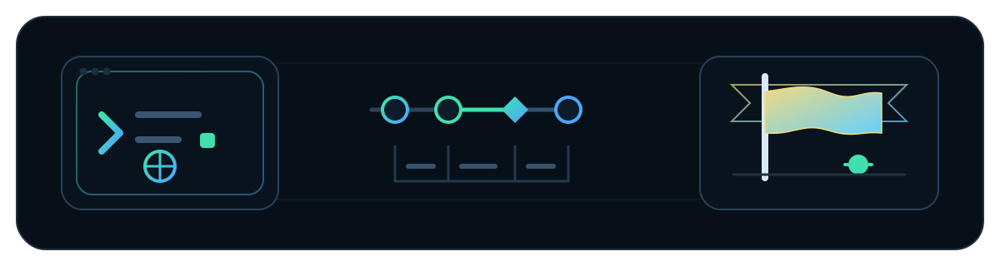
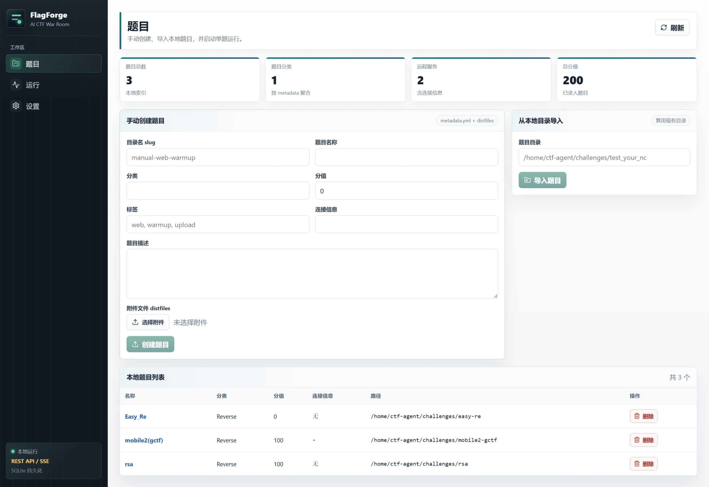
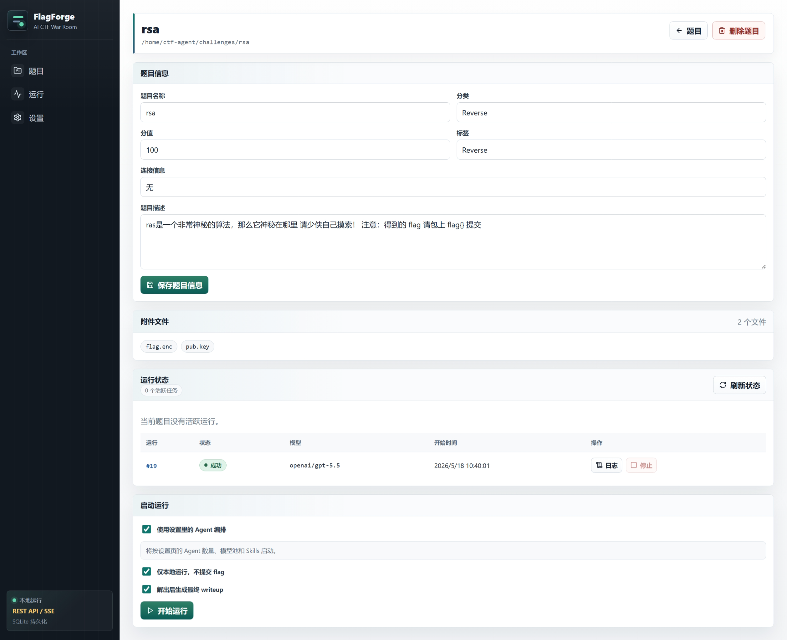

<p align="center">
  
</p>

<h1 align="center">FlagForge</h1>

<p align="center">
  <em>面向非即时判题 CTF / 电子数据取证比赛的本地智能解题工作台。</em>
</p>

<p align="center">
  
  
  
  
  
  
</p>

<p align="center">
  <strong>Flask API · SQLite 持久化 · SSE 实时日志 · Docker 解题沙箱 · 多 Agent 编排 · Markdown Writeup · 获胜 Agent 问答</strong>
</p>

---

FlagForge 是一个本地运行的 CTF 智能解题工作台。它把题目录入、附件管理、模型配置、Agent 编排、实时日志、运行历史、writeup 复盘和获胜 Agent 问答整合到一个中文 Web 控制台里，适合个人练习、比赛复盘和快速验证题目。

后端使用 Python + Flask + SQLite，前端使用 Vue 3 + Vite。真实解题时，Solver 会在 Docker 沙箱中运行常用 CTF 工具，并通过 OpenAI 兼容 API、Codex CLI、Claude SDK 或其他已接入 provider 调用模型。

## 软件截图

<table>
  <tr>
    <td width="33%">
      <strong>创建题目</strong><br/>
      
    </td>
    <td width="33%">
      <strong>题目详情</strong><br/>
      
    </td>
    <td width="33%">
      <strong>运行详情</strong><br/>
      
    </td>
  </tr>
</table>

## 功能概览

- 中文 Web 控制台：题目、运行、设置三个核心页面。
- 手动创建题目：前端填写 `metadata.yml` 字段，上传 distfiles，并可自定义每个附件的保存文件名。
- 导入本地题目：直接索引已有题目目录，目录内需要包含 `metadata.yml`。
- 题目信息编辑：在前端编辑名称、分类、分值、描述、连接信息、标签和 hints。
- 题目删除：可只删除 FlagForge 索引，也可由 API 删除本地题目文件。
- Agent 解题运行：按设置页的 Agent 数量、模型池和 Skills 启动，也可在单次运行前手动指定模型。
- 随时停止运行：运行列表和题目详情页都可以停止活跃运行。
- 状态查看：运行状态会自动刷新，支持 `queued`、`running`、`succeeded`、`failed`、`cancelled`、`interrupted`。
- 日志管理：运行中显示 SSE 实时日志，结束后显示历史日志，避免重复渲染导致页面卡顿；历史日志可刷新、清空和随运行记录删除。
- Writeup 生成：运行前可选择是否在解出 flag 后生成最终 writeup。
- Markdown 渲染与下载：writeup 在前端渲染成站点风格的 HTML，代码块带复制按钮，同时支持下载 Markdown。
- 获胜 Agent 问答：如果获胜 Agent 的 session 仍在当前后端进程中，前端可以继续向它提问。
- API 配置界面：前端可配置 OpenAI 兼容中转站、密钥、CTFd、Agent 数量、模型池和 Skills。
- 模型列表来自 API：后端会请求配置的 OpenAI 兼容中转站 `/models` 或 `/v1/models`，不会在前端硬编码模型列表。
- Skills 默认全启用：`FLAGFORGE_AGENT_SKILLS` 留空时，后端会启用本机全部 Codex Skills。

## 快速启动

### 1. 准备环境

需要：

- Python 3.14+
- `uv`
- Node.js 20+ 和 npm
- Docker（真实运行 solver 时需要）
- 至少一个可用模型 API Key

安装依赖：

```bash
uv sync
npm --prefix frontend install
```

构建解题沙箱镜像：

```bash
docker build -f sandbox/Dockerfile.sandbox -t ctf-sandbox .
```

复制配置文件：

```bash
cp .env.example .env
```

最小可用配置示例：

```env
OPENAI_BASE_URL=https://api.psydo.top
OPENAI_API_KEY=sk-your-key

FLAGFORGE_AGENT_COUNT=1
FLAGFORGE_AGENT_MODELS=gpt-5.5
FLAGFORGE_AGENT_SKILLS=

CTFD_URL=https://ctf.example.com
CTFD_TOKEN=ctfd_your_token
```

不要把真实 API Key 提交到 GitHub。`.env` 应该只保留在本地。

### 2. 一键启动前后端

```bash
./start.sh
```

默认地址：

- 前端：`http://127.0.0.1:5174`
- 后端：`http://127.0.0.1:5001`
- 后端健康检查：`http://127.0.0.1:5001/api/health`

日志文件：

```text
logs/flagforge-backend.log
logs/flagforge-frontend.log
```

按 `Ctrl+C` 会同时停止前端和后端。

端口被占用时：

```bash
BACKEND_PORT=5002 FRONTEND_PORT=5175 ./start.sh
```

## Web 使用流程

### 创建题目

进入“题目”页面，可以选择两种方式。

手动创建：

1. 填写目录名 slug、题目名称、分类、分值、标签、连接信息和描述。
2. 上传附件文件。
3. 为每个附件设置写入 `distfiles/` 后的文件名。
4. 点击“创建题目”。

后端会写入：

```text
challenges/<slug>/metadata.yml
challenges/<slug>/distfiles/<uploaded-files>
```

导入本地目录：

1. 准备一个已有题目目录。
2. 确保目录内有 `metadata.yml`。
3. 在前端输入目录路径并导入。

示例目录见：

```text
examples/manual-challenge/
```

示例 `metadata.yml`：

```yaml
name: Manual Upload Example
category: misc
value: 100
description: |
  Example challenge directory matching the Web UI manual upload format.
connection_info: ""
tags:
  - example
  - manual-upload
hints:
  - content: Inspect the attached README first.
```

如果想把新题目写到其他目录：

```bash
CTF_AGENT_CHALLENGE_ROOT=/path/to/challenges ./start.sh
```

### 启动运行

进入题目详情页后，在“启动运行”区域可以：

- 使用设置页里的 Agent 编排。
- 或关闭默认编排，手动选择单次运行模型。
- 选择是否“仅本地运行，不提交 flag”。
- 选择是否“解出后生成最终 writeup”。

默认行为：

- 默认模型：`gpt-5.5`
- 默认 provider：OpenAI 兼容 API
- 默认模型规格：`openai/gpt-5.5`
- 默认 Agent 数量：`1`
- 默认 Skills：本机全部 Codex Skills
- 默认生成 writeup：开启
- 默认不提交 flag：开启

### 查看运行

“运行”页面用于查看所有历史记录和活跃任务。

运行详情页包含：

- 运行信息
- 实时或历史日志
- Writeup
- 向获胜 Agent 提问
- 最终结果

运行中展示 SSE 实时日志。运行结束后切换为历史日志，支持刷新和清空。运行记录删除时，对应日志和 writeup 文件也会删除。

### Writeup 与 Agent 问答

如果运行成功且“生成最终 writeup”已开启，后端会向获胜 Agent 再发送一个复盘请求，要求它输出适合初学者学习的中文 Markdown writeup。

前端会把 writeup 渲染成紧凑排版的 HTML，代码块右上角有复制按钮，也可以下载原始 Markdown。

获胜 Agent 的 session 只保存在当前后端进程内。后端重启后，历史 writeup 仍然可查看和下载，但已保留的 Agent 会话通常不可继续提问。

## 模型与 API 配置

进入“设置”页面可以配置：

- `OPENAI_API_KEY`
- `OPENAI_BASE_URL`
- `ANTHROPIC_API_KEY`
- `ANTHROPIC_BASE_URL`
- `ANTHROPIC_AUTH_TOKEN`
- `GEMINI_API_KEY`
- `CTFD_URL`
- `CTFD_TOKEN`
- `CTFD_USER`
- `CTFD_PASS`
- `FLAGFORGE_AGENT_COUNT`
- `FLAGFORGE_AGENT_MODELS`
- `FLAGFORGE_AGENT_SKILLS`
- `FLAGFORGE_WRITEUP_PROMPT`

敏感字段默认隐藏，但可以点击输入框右侧的小眼睛从本地后端读取原文：

- 输入新值：更新 `.env`
- 留空：保持原值
- 勾选清空：写入空值

### OpenAI 兼容中转站

默认配置：

```env
OPENAI_BASE_URL=https://api.psydo.top
FLAGFORGE_AGENT_MODELS=gpt-5.5
```

模型列表不是前端猜出来的。后端读取 `OPENAI_BASE_URL` 和 `OPENAI_API_KEY` 后，会先请求：

```text
<OPENAI_BASE_URL>/models
```

如果 `OPENAI_BASE_URL` 本身不以 `/v1` 结尾，后端还会兜底请求 `<OPENAI_BASE_URL>/v1/models`。

接口返回的模型 ID 会被转成可运行的模型规格：

```text
gpt-5.5 -> openai/gpt-5.5
```

如果模型接口不可用，前端会展示错误信息并保留 `gpt-5.5` 作为默认模型，不把本地猜测结果伪装成中转站模型列表。

### Agent 数量、模型池和 Skills

示例：

```env
FLAGFORGE_AGENT_COUNT=3
FLAGFORGE_AGENT_MODELS=gpt-5.5,gpt-5.4,gpt-5.4-mini
FLAGFORGE_AGENT_SKILLS=
FLAGFORGE_WRITEUP_PROMPT=请基于你刚才完整的 CTF 解题过程，输出一份适合初学者学习复盘的中文 Markdown writeup。要求包含：题目背景、关键漏洞/思路、尝试过程、最终利用步骤、flag、常见坑点和复盘建议。不要省略关键命令或推理。
```

含义：

- `FLAGFORGE_AGENT_COUNT` 控制一次运行启动多少个 solver agent，范围是 1 到 12。
- `FLAGFORGE_AGENT_MODELS` 是模型池，数量不足时会循环使用。
- 模型名可以写 `gpt-5.5`，后端会自动规范化为 `openai/gpt-5.5`。
- `FLAGFORGE_AGENT_SKILLS` 留空表示启用全部本机 Codex Skills。
- 如果只想启用部分 Skills，可以用逗号或换行分隔。
- `FLAGFORGE_WRITEUP_PROMPT` 是解出 flag 后发送给获胜 Agent 的 writeup 生成提示词，默认中文。

示例：

```env
FLAGFORGE_AGENT_SKILLS=ctf-web,ctf-pwn,ctf-writeup
```

Skills 会注入 solver prompt。如果本机存在 `/root/.codex/skills`，Docker 沙箱内也会只读挂载该目录，方便 Agent 按题型读取技能说明。

### Codex CLI Provider

Web 默认使用 `openai/gpt-5.5`，也就是 OpenAI 兼容 API provider。如果你手动选择 `codex/...` 模型，后端会调用本机 `codex app-server`，这时需要单独配置 Codex CLI。

参考 `~/.codex/config.toml`：

```toml
model_provider = "OpenAI"
model = "gpt-5.5"
review_model = "gpt-5.5"
model_reasoning_effort = "xhigh"
disable_response_storage = true
network_access = "enabled"
windows_wsl_setup_acknowledged = true
model_context_window = 1000000
model_auto_compact_token_limit = 900000

[model_providers.OpenAI]
name = "OpenAI"
base_url = "https://api.psydo.top"
wire_api = "responses"
requires_openai_auth = true
```

API Key 请通过环境变量或本机安全配置提供，不要写入 README 或提交到仓库。

## CLI 用法

除了 Web 控制台，项目也保留了命令行入口。

单题运行：

```bash
uv run ctf-solve \
  --challenge examples/manual-challenge \
  --models openai/gpt-5.5 \
  --no-submit \
  -v
```

连接 CTFd 并启动 coordinator：

```bash
uv run ctf-solve \
  --ctfd-url https://ctf.example.com \
  --ctfd-token ctfd_your_token \
  --challenges-dir challenges \
  --max-challenges 10 \
  --coordinator codex \
  -v
```

向运行中的 coordinator 发送提示：

```bash
uv run ctf-msg "优先检查所有 web 题的 robots.txt 和备份文件"
```

## API 速览

健康检查：

```text
GET /api/health
```

题目：

```text
GET    /api/challenges
POST   /api/challenges
POST   /api/challenges/manual
GET    /api/challenges/<id>
PUT    /api/challenges/<id>
DELETE /api/challenges/<id>
```

运行：

```text
GET    /api/runs
POST   /api/runs
GET    /api/runs/<id>
DELETE /api/runs/<id>
POST   /api/runs/<id>/cancel
GET    /api/runs/<id>/logs
DELETE /api/runs/<id>/logs
GET    /api/runs/<id>/logs/stream
GET    /api/runs/<id>/writeup
GET    /api/runs/<id>/writeup/download
GET    /api/runs/<id>/agent/messages
POST   /api/runs/<id>/agent/messages
```

配置：

```text
GET /api/config
PUT /api/config
GET /api/config/secrets/<key>
GET /api/models
POST /api/models/test
```

## 项目结构

```text
backend/
  app/              # 配置、题目服务、运行管理、Skills 目录发现
  agents/           # Swarm、Pydantic AI Solver、Codex Solver、Claude Solver
  storage/          # SQLite repo 和 schema bootstrap
  web/              # Flask app 和 REST/SSE 路由
  tools/            # sandbox、flag、vision 等工具
frontend/
  src/              # Vue 页面、组件、API 封装和样式
sandbox/
  Dockerfile.sandbox
  sandbox-tools.txt
examples/
  manual-challenge/
scripts/
  start-flagforge.sh
tests/
  app/
  storage/
  web/
```

本地运行时会生成：

```text
.ctf-agent/web.sqlite3
.ctf-agent/logs/runs/<run-id>.log
.ctf-agent/logs/writeups/<run-id>.md
logs/flagforge-backend.log
logs/flagforge-frontend.log
challenges/
```

这些运行数据通常不应该提交到 GitHub。

## 生产构建

构建前端：

```bash
npm --prefix frontend run build
```

由 Flask 直接服务构建后的前端：

```bash
uv run python -m backend.web.app
```

默认地址：

```text
http://127.0.0.1:5000
```

也可以指定端口：

```bash
CTF_AGENT_HOST=127.0.0.1 CTF_AGENT_PORT=5001 uv run python -m backend.web.app
```

## 测试

后端测试：

```bash
uv run pytest
```

前端构建检查：

```bash
npm --prefix frontend run build
```

启动脚本测试：

```bash
uv run pytest tests/test_start_script.py
```

## 安全说明

FlagForge 当前按本地单用户工作台设计：

- 不要把 Flask 后端直接暴露到公网。
- 不要提交 `.env`、API Key、CTFd Token、运行日志、writeup 或题目附件中的敏感数据。
- Solver 会执行模型生成的命令，真实运行前请确认 Docker 沙箱镜像和挂载目录符合你的隔离要求。
- CTFd 提交功能会使用配置的 token 或账号密码；练习时建议开启“仅本地运行，不提交 flag”。

## License

MIT License. See [LICENSE](LICENSE).

## Acknowledgements

- [es3n1n/Eruditus](https://github.com/es3n1n/Eruditus)：`pull_challenges.py` 中的 CTFd 交互和 HTML 辅助思路。
- [verialabs/ctf-agent](https://github.com/verialabs/ctf-agent)：FlagForge 基于该 MIT License 项目的 agent 架构、CTFd 集成和 Docker 沙箱思路继续构建，并在此基础上扩展了中文 Web 控制台、运行历史、writeup 复盘和配置界面。
